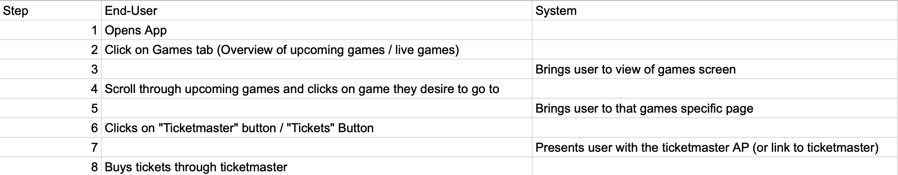
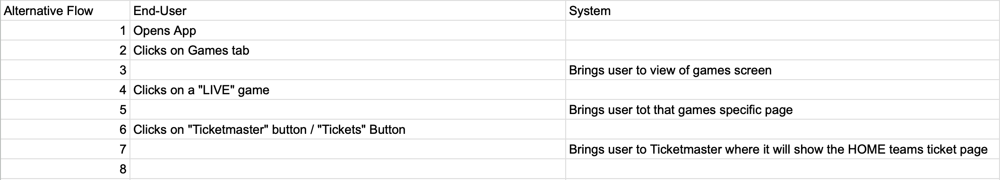

# Non-functional Requirements

## Open source

The app's source code will be available for public access, allowing end-users to review, modify, and contribute.
Comprehensive documentation will be provided, detailing the steps required to set up, build, and run the app locally, ensuring ease of customization and deployment.
## Security

All sensitive user data will be encrypted using AES (Advanced Encryption Standard) for data at rest, ensuring fast and secure encryption.
For data in transit, TLS (Transport Layer Security) will be used to prevent eavesdropping and tampering.
RSA or Elliptic Curve Cryptography (ECC) will be employed for secure key exchange.
Passwords will be hashed using algorithms like bcrypt or Argon2, ensuring that passwords are not stored in plain text.
## Reliability

The app will include basic error handling to ensure it continues running smoothly even if minor issues occur.
In case of temporary failures, the app will automatically retry operations.
Regular monitoring will track performance and alert developers to any problems.
The app will be tested thoroughly to handle common issues and ensure stable performance, even under increased usage.
# Player Performance Tracking

## Actors
1. ESPN's hidden API
2. End-user

## Use case goal
To allow end-users to be able to track the player performance data during a live game using ESPN’s hidden API.

## Primary Actor
The end-user will be the primary actor. Could be a fan or a coach.

## Preconditions
1. ESPN API must be connected to the application
2. The user must have access to the application
3. the game being tracked must be ongoing or a finished game
   
## Basic flow
1. The user will select a game they want to track in the application.
2. The application sends a request to ESPN’s hidden API for player performance data.
3. The API retrieves and sends back the data of the player like goals and assists.
4. The application displays the data requested by user.

## Alternative flows

### Alternative flow 1
If the game the user requested has ended, the app will display past records including the recently concluded game.

### Alternative flow 2
If ESPN API is not available, the application will display a message that says "Temporarily unavailable, please try again".

# Match Streaming Resources

## Actors
1. End-user
2. YouTube API
3. ESPN's hidden API

## Use case goal
User is able to view what games are live and to direct the user to what platform the game is broadcasting on.

## Primary Actor
End-User

## Preconditions
1. User has an internet connection
2. User has a device capable to be redirected to the steaming website via internet browser or application
3. User is logged in to a valid account to see customized content
   
## Basic flow
1. User is able to navigate to the "Live Games" feed
2. User is presented with "Highlighted Live Games" and other games that are currently streaming along with scores.
3. User is able to navigate through broadcasted games, sports and search for more games
4. User is can select a game to see where they are able to watch the game
5. User is directed to the platform of their choosing

## Alternative flows

### Alternative flow 1
User does not have an internet access
1. User is shown a message for not having a connection

### Alternative flow 2
Customized Live Games Feed
1. User is able to login to an account
2. User is able to view their followed team's games under the "Highlighted Live Games" section

### Alternative flow 3
Searching for Other Games
1. User is able to select a "search" icon to bring up a search bar with suggestions
2. User is able to select games based on their search
3. If the user's search is unable to find a game they notified and prompted with suggestions 

# Sports News Feed

## Actors
1. End-user
2. Google API
3. Facebook API
4. YouTube API
5. ESPN's hidden API

## Use case goal
The goal is to provide the user with real-time sport news feed from the above APIs.
## Primary Actor
End-user(sport fan)

## Preconditions
1. User has internet access
2. All API are accessible and functional
3. User should be logged in
   
## Basic flow
1. The user accesses the sports news feed. (Logs in if required)
2. The system gathers sports news articles, live sports data, video highlights from APIs
3. The sports news feed displays a combination of news articles, social media posts, videos, and live scores/stats in an organized manner for the user.

## Alternative flows

### Alternative flow 1
The end user could customize their feed to display news about their favorite players and sport.

### Alternative flow 2
If a particular API is not functioning, the system detects it and let the user know while displaying other available content from other APIs

# User Authentication System

## Actors
1. End-user
2. Google API
3. Facebook API
4. YouTube API
5. ESPN's hidden API

## Use case goal
Allow users to securely access the application by verifying their identity through a login process, ensuring authorized access to personalized features and data within the system.
## Primary Actor
End-user
## Preconditions
None
## Basic flow
1. The user opens the application and navigates to the login page.
2. The user inputs their username/email and password.
3. The system checks if the entered credentials are valid.
4. If credentials match a registered user, then the system creates a session and grants access.
## Invalid Credentials
1. If credentials are invalid, an error message is displayed (e.g., "Invalid username or password").
2. The application database logs the authentication event for security and audit purposes.
### Forgotten Password
1. The user selects the "Forgot Password" link on the login page.
2. The app prompts the user to enter their registered email or username.
3. The system sends a password reset email (or SMS) with a secure reset link to the user’s registered email or phone.
4. The user opens the email and clicks on the provided link, which directs them to a secure password reset page
5. The user provides and confirms a new password
6. Upon successful entry, the system updates the password and confirms the reset.

# Social Features

## Actors
1. End-user
2. Facebook API
3. YouTube API

## Use case goal
Support friend management, including adding and interacting with friends within the platform.
## Primary Actor
End-User
## Preconditions
1. Creating an Account
2. Security and Privacy(Encrypt data, enable blocking/reporting, and manage profile visibility.)

## Basic flow
1. Open Social Features Page: User accesses the "Friends" tab from the edu.metrostate.main navigation.
2. Friend List Display: User sees a list of current friends with profile pictures, online status, and quick action buttons (message, challenge).
3. Search/Add Friends: User searches for new friends via a search bar and sends a friend request.
4. Manage Friend Requests: Pending friend requests are listed with options to accept or reject.
5. Interact with Friends: User can tap a friend to view their profile, send a message, or challenge them to a game.
6. Activity Feed: Display recent activities from friends (matches, achievements).
7. Notifications: User receives alerts for friend requests, challenges, and messages.

## Alternative flows

### Alternative flow 1
Quick Add and Interaction
1. Open Notifications: User taps notifications to see friend requests or interactions.
2. Manage Requests: User accepts/rejects friend requests directly from the notification center.
3. Interact: Taps on a friend’s notification to jump into a chat or challenge them to a game.
### Alternative flow 2
Profile Centered Interaction
1. Open User Profile: User accesses their profile page and selects "Friends."
2. Friend Suggestions: Based on mutual sports interests, suggestions are shown with “Add Friend” buttons.
3. Interact: Tap on a friend's profile for messaging, challenges, or viewing recent activities.

## Actors
1. End-user
2. Facebook API
3. YouTube API

## Use case goal

## Primary Actor

## Preconditions

## Basic flow

## Alternative flows

### Alternative flow 1

### Alternative flow 2

# Ticket Purchasing

## Actors
1. End-user
2. Google API
3. YouTube API
4. Ticketmaster API

## Use case goal

- End-user able to enter application, view all the sports games that
are upcoming and be able to click button that will bring them to Ticketmaster to
order tickets for the game they select

## Primary Actor

- End-user / Application User

## Preconditions

1. Internet Access
2. View of upcoming games ( this will be from Sports Feed/Game Viewing or Team Page)
3. Ticketmaster Button
4. Ticketmaster API

## Basic flow

## LIVE Games (Tickets are unable to be purchased)

