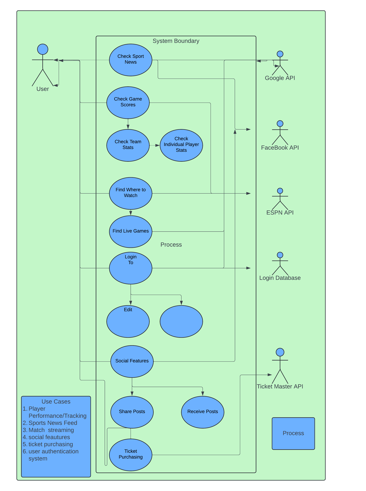

# Application Specification
The application is a sports management platform providing users with tools to track player performance, stream live matches, view sports news, interact socially with other fans, purchase tickets for events, and access these features securely through a user authentication system.
The system is designed to cater to a wide variety of users, including sports fans, team managers, event organizers, and content providers.
## Problem Statement
Sports fans, managers, and organizers struggle with using multiple platforms to track player stats, watch live games, buy tickets, and stay updated on news.
This creates a messy, disconnected experience. There's also a need for secure user authentication and a better way for fans to connect with each other.
We need a single platform that brings all these features together in one place, making it easy, secure, and fun to use.
## Functional Requirements

1. Player Performance Tracking
2. Match Streaming Resources
3. Sports News Feed
4. User Authentication System
5. Social Features
6. Ticket Purchasing

## Non-functional

1. Open source
2. Security
3. Reliability

## Use Cases

### Track Player Performance

#### Stakeholders and Actors
1. ESPN's hidden API
2. End-user
#### Use Case Goal
Allow users to view detailed performance statistics for specific players, including past match history, statistics, and performance metrics.
#### Primary Actor
End-user
#### Preconditions
None
#### Basic Flow
1. User selects the "Player Performance" option from the menu.
2. User searches for or selects a specific player.
3. System retrieves and displays the player’s performance statistics.
4. User views detailed stats like goals, assists, match performance, etc.
#### Alternative Flows
1. If no data is available for the selected player, the system displays a "No data available" message.
2. If the player is not in the database, the system prompts the user to search again or suggests similar players.

### Access Match Streaming Resources

#### Stakeholders and Actors
1. End-user
2. Google API
#### Use Case Goal
Enable users to access live match streams or available replays.
#### Primary Actor
Google API
#### Preconditions
Streaming rights are available for the specific match.
#### Basic Flow
1. User selects a match from the schedule.
2. System checks the availability of streaming resources.
3. If available, the system provides streaming links or embedded streams.
4. User clicks the streaming link to watch the match.
#### Alternative Flows
The system informs the user that the stream is unavailable, suggesting other available matches or replay options.
###  View Sports News Feed

#### Stakeholders and Actors
1. End-user
2. Google API
3. Facebook API
4. YouTube API
5. ESPN's hidden API
#### Use Case Goal
Provide users with real-time sports news updates based on their preferences.
#### Primary Actor
1. ESPN's hidden API
#### Preconditions
News content is available and updated.
#### Basic Flow
1. User navigates to the sports news feed section.
2. System retrieves the latest sports news articles from content providers.
3. User scrolls through and reads articles of interest.
#### Alternative Flows
The system displays a message stating "No news available" if no content is retrieved.

### Authenticate User

#### Stakeholders and Actors
1. End-user
2. Google API
3. Facebook API
4. YouTube API
5. ESPN's hidden API
#### Use Case Goal
Authenticate users to allow secure access to their personalized data and features.
#### Primary Actor
End-user
#### Preconditions
None
#### Basic Flow
User enters username and password on the login screen.
System verifies the credentials.
If valid, the system grants access to the user.
#### Alternative Flows
1. If credentials are invalid, an error message is displayed (e.g., "Invalid username or password").
2. The application database logs the authentication event for security and audit purposes.
### Interact with Social Features

#### Stakeholders and Actors
1. End-user
2. Google API
3. Facebook API
4. YouTube API
5. ESPN's hidden API
#### Use Case Goal
Allow users to interact with other users via comments, likes, shares, and discussions about sports topics.
#### Primary Actor
End-user
#### Preconditions
1. User is authenticated and has access to social features.
2. Other users are participating in social discussions.
#### Basic Flow
1. User navigates to the social section (e.g., comments or forums).
2. User reads posts and comments from other users.
3. User interacts by liking, commenting, or sharing content.
#### Alternative Flows
1. If no posts are available, the system displays a message like "No discussions available."
2. If a post violates community guidelines, the system removes it, and the user is notified.
### Purchase Event Tickets

#### Stakeholders and Actors
1. End-user
2. Ticket Master API
#### Use Case Goal
Enable users to purchase tickets for upcoming sports events.

#### Primary Actor
Ticket Master API
#### Preconditions
None
#### Basic Flow
1. User browses or searches for an event.
2. System displays available tickets and seat information.
3. User selects preferred seats.
4. System redirects the user to the third party ticketing website.
5. User completes the purchase on the third-party site.
#### Alternative Flows
If no tickets are available, the system displays a "Tickets Unavailable" message.
## Use Case Diagram

