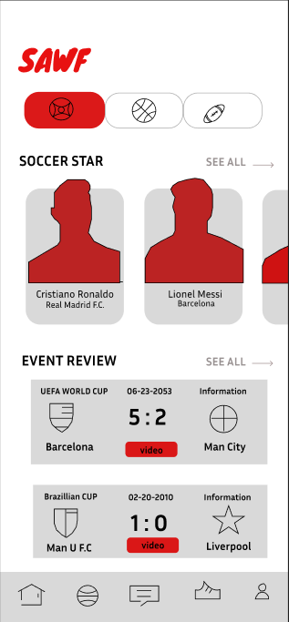
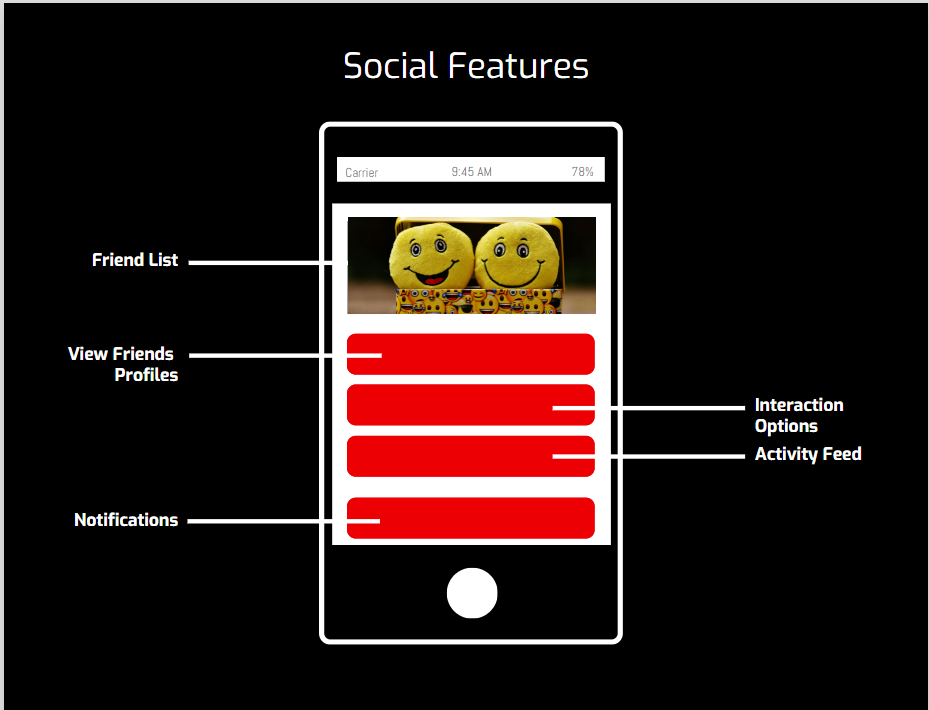

# Wireframes

## Home Screen 

The home screen of the SAWF app displays live scores of
ongoing matches, provides highlights and brief sport news to
users. Through the home screen users also have access to watch
matches, explore news in details and also check scores.
The home page will so be designed to fit users favorite team,
sport and players.

## News Page

The News page is a page to check out all the hot topics in the sports world! You can choose teams to follow and
put on your homepage so you do not miss a thing. You will also be able to check out trending stories of your liking
along with add your reaction to the news.

## Login Page

This login page allows users to sign in using their email and password or via Facebook or Google accounts.
It includes options to remember login details, recover a forgotten password, and create a new account.

## Social Features Page

This login page allows users to sign in using their email and password or via Facebook or Google accounts.
It includes options to remember login details, recover a forgotten password, and create a new account.

## Ticket purchase page

this page provides the users with upcoming games along with an option to purchase a ticket via TicketMaster. 
It provides users ability to choose their favorite team and filter upcoming games of their favorite team.
